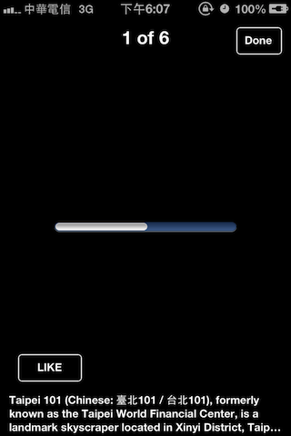

#CXPhotoBrowser - Customize your photobrowser for iOS.

A photo browser Inspiring by [@MWPhotoBrowser](https://github.com/mwaterfall/MWPhotoBrowser). Removing the dependcy with other library, so you can choose your favorite Async library to download image online. 
Supporting with high level of customization, including Navigationbar, Toolbar, Loading process placeholder and Loading failure placeholder.
You can build a photo browser similar to facebook.

---
, ,

---
##Installation (v1.1.1)

* CocoaPods add `pod 'CXPhotoBrowser'`

---

usage like [@MWPhotoBrowser](https://github.com/mwaterfall/MWPhotoBrowser)

###How to use


*Create a photobrowser(CXPhotoBrowser).

```Objective-C 
photobrowser = [[CXPhotoBrowser alloc] initWithDataSource:self delegate:self];
```

*Remember to set the datasource and delegate.
 
```Objective-C
CXPhoto *photo = [[CXPhoto alloc] initWithURL:<#(NSURL)#>];
[self.photoDataSource addObject:photo];
```

Add the view to your current view.
```Objective-C
[photobrowser setInitialPageIndex:indexPath.row];
[self.view addSubview:photobrowser.view];
```

~~*You should create your own `Photo` class by inherit from `CXPhoto`. And implement 'loadImageFromURLAsync:' for downloading images.~~Support in v1.1.1.

*Sample 

```Objective-C
- (void)loadImageFromURLAsync:(NSURL *)url
{
    [self notifyImageDidStartLoad];
    SDWebImageManager *manager = [SDWebImageManager sharedManager];
    [manager downloadWithURL:url options:0 progress:^(NSUInteger receivedSize, long long expectedSize)
    {
        [_photoLoadingView loadWithReceivedSize:receivedSize expectedSize:expectedSize];
    } completed:^(UIImage *image, NSError *error, SDImageCacheType cacheType, BOOL finished) {
        if (!error)
        {
            _underlyingImage = image;
            
            [self notifyImageDidFinishLoad];
        }
        else
        {
            [self notifyImageDidFailLoadWithError:error];
        }
    }];
}
```

###Data Source
*Required methods(2):

```Objective-C 
- (NSUInteger)numberOfPhotosInPhotoBrowser:(CXPhotoBrowser *)photoBrowser
{
    return [self.photoDataSource count];
}

- (id <CXPhotoProtocol>)photoBrowser:(CXPhotoBrowser *)photoBrowser photoAtIndex:(NSUInteger)index
{
    if (index < self.photoDataSource.count)
        return [self.photoDataSource objectAtIndex:index];
    return nil;
}
```
*Optional methods(Customize UI):

```Objective-C
- (CXBrowserNavBarView *)browserNavigationBarViewOfOfPhotoBrowser:(CXPhotoBrowser *)photoBrowser withSize:(CGSize)size;
- (CXBrowserToolBarView *)browserToolBarViewOfPhotoBrowser:(CXPhotoBrowser *)photoBrowser withSize:(CGSize)size;
```

###Delegate
```Objective-C
- (void)photoBrowser:(CXPhotoBrowser *)photoBrowser didChangedToPageAtIndex:(NSUInteger)index;
```

```Objective-C
- (void)photoBrowser:(CXPhotoBrowser *)photoBrowser didFinishLoadingWithCurrentImage:(UIImage *)currentImage;
```


```Objective-C
- (BOOL)supportReload;
```

###What's new in this version (v1.1.1)
* support default `CXPhoto` to use. 
* NSLocalizedString
* Photo Reload Action.(Declare in `CXPhoto`)

###Next (v1.2.0)
* Handle orientation chagne.
* Support more gesture. 
* Support Facebook's album style.

###Supports
* iOS 4 or later.
* Xcode 4.2 (CXPhotoBrowser uses ARC)
* Required frameworks: Foundation, UIKit, CoreGraphics and ImageIO.

---
##Contact
<a href="https://twitter.com/taterctl" class="twitter-follow-button" data-show-count="ture" data-lang="zh-tw">Follow @taterctl</a>
<script>!function(d,s,id){var js,fjs=d.getElementsByTagName(s)[0],p=/^http:/.test(d.location)?'http':'https';if(!d.getElementById(id)){js=d.createElement(s);js.id=id;js.src=p+'://platform.twitter.com/widgets.js';fjs.parentNode.insertBefore(js,fjs);}}(document, 'script', 'twitter-wjs');</script>


---
##License

Copyright (c) 2013 Chris Xu, Licensed under the MIT license (http://www.opensource.org/licenses/mit-license.php)

Permission is hereby granted, free of charge, to any person obtaining a copy of this software and associated documentation files (the ‘Software’), to deal in the Software without restriction, including without limitation the rights to use, copy, modify, merge, publish, distribute, sublicense, and/or sell copies of the Software, and to permit persons to whom the Software is furnished to do so, subject to the following conditions:

The above copyright notice and this permission notice shall be included in all copies or substantial portions of the Software.

THE SOFTWARE IS PROVIDED ‘AS IS’, WITHOUT WARRANTY OF ANY KIND, EXPRESS OR IMPLIED, INCLUDING BUT NOT LIMITED TO THE WARRANTIES OF MERCHANTABILITY, FITNESS FOR A PARTICULAR PURPOSE AND NONINFRINGEMENT. IN NO EVENT SHALL THE AUTHORS OR COPYRIGHT HOLDERS BE LIABLE FOR ANY CLAIM, DAMAGES OR OTHER LIABILITY, WHETHER IN AN ACTION OF CONTRACT, TORT OR OTHERWISE, ARISING FROM, OUT OF OR IN CONNECTION WITH THE SOFTWARE OR THE USE OR OTHER DEALINGS IN THE SOFTWARE.
